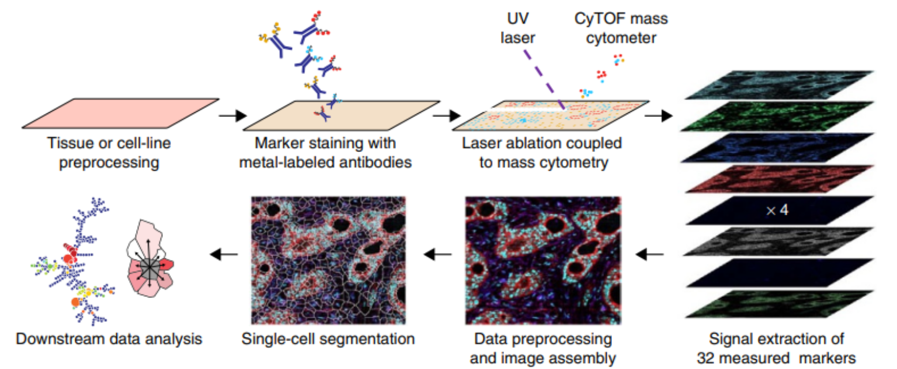

# An introduction to imaging mass cytometry

Imaging mass cytometry utilizes metal-tagged antibodies to detect up to 40 proteins in tissues.

*Overview of imaging mass cytometry data acquisition. Taken from Giesen et al.[^fn1]*

## What it is

## How it works

Explain panoramas

## How the data looks like

[^fn1]: Giesen, C. _et al._ 2014. “Highly Multiplexed Imaging of Tumor Tissues with Subcellular Resolution by Mass Cytometry.” Nature Methods 11 (4): 417–22.